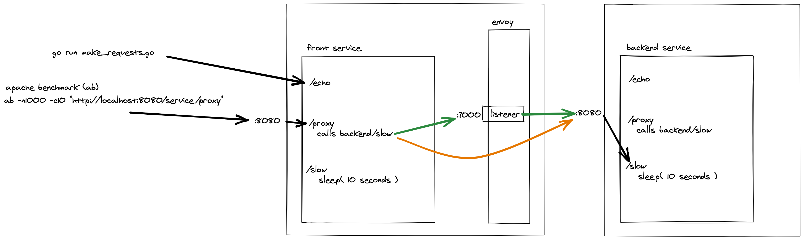

# Circuit Breakers
The idea here is to illlustrate a common failure mode of distributed systems -- a cascading failure -- and how to mitigate with circuit breaking with Envoy proxy.

Imagine a web service comprised of two services, a "front service" which is exposed to the public internet and called directly by clients out in the world, and a "backend service" which provides some sort of feature that "front service" calls in order to provide/expose to clients out in the world.

The `/slow` endpoint is designed to simulate the "backend service" becoming unresponsive by sleeping for 10 seconds for each request, and **the goal** of introducing Envoy Proxy between "front service" and "backend service" is for "front service" to continue to be responsive to calls to the `/echo` endpoint, even when other clients are calling `/proxy` at a sufficient level of concurrency to saturate the "backend service"'s worker threads. This should happen by Envoy Proxy opening the circuit breaker between "front service" and "backend service".

For simplicity, "front service" and "backend service" are the same Java service and are just configured for one to be in front of the other.



## Instructions to run the simulation

You can choose to route traffic to "backend service" either through the Envoy Proxy, or directly to the "backend service", so you can see what happens in the below steps when you have circuit breaking and when you don't.

In order to switch between routing through Envoy and calling "backend service" directly, change the following lines in `docker-compose.yml`:

```
      #################################
      # IMPORTANT: Change between these two in order to go through
      # the Envoy proxy OR alternatively hit the backend service directly,
      # bypassing the circuit breaking features of Envoy.

      # hit the service directly, do not go through envoy
#      - BACK_SERVICE_HOSTNAME=backendservice
#      - BACK_SERVICE_PORT=8080

      # hit the service THROUGH envoy
      - BACK_SERVICE_HOSTNAME=127.0.0.1
      - BACK_SERVICE_PORT=7000
```

### 1. how to start the whole thing

```
docker-compose rm -f && make build && docker-compose up --build --remove-orphans
```

### 2. watch the circuitbreaker metrics (in a separate terminal window)
```
watch -n0.1 -d "curl -s http://localhost:8001/stats | egrep '(\dxx|circuit)' | grep -v admin"
```

note, once the circuit breaker opens, you'll see `cluster.backendservicecluster.circuit_breakers.default.cx_open: 0`
change to
`cluster.backendservicecluster.circuit_breakers.default.cx_open: 1`

### 3. hit a fast endpoint continuously (in a separate terminal window)
```
go run make_requests.go
```

### 4. start hammering the site on a slow, proxied endpoint that calls the backend service (in a separate terminal window)
```
ab -n1000 -c10 "http://localhost:8080/service/proxy"
```

### 5. watch the fast endpoint seize up and stop responding, then switch to routing the calls to backendservice through envoy instea

TODO: it seems like you would have to update `envoy.yaml` for each new service you would want to call; maybe not a huge deal but if you're gonna do that, maybe you'd be better off just remembering to fail fast in the /slow endpoint, or circuit break aggressively in the code in "front service"
   - can you add dynamic listeners?
   - can you proxy all calls through a single wildcard and route to N clusters?

# reading and other resources

[Envoy, Take the Wheel: Real-time Adaptive Circuit Breaking - Tony Allen, Lyft](https://www.youtube.com/watch?v=CQvmSXlnyeQ)

https://blog.turbinelabs.io/a-guide-to-envoys-backpressure-22eec025ef04

https://blog.turbinelabs.io/circuit-breaking-da855a96a61d

# further questions, TODOs

Overload manager vs. circuitbreaking
TODO: also need to prevent envoy itself from getting overloaded
https://www.envoyproxy.io/docs/envoy/latest/intro/arch_overview/operations/overload_manager#arch-overview-overload-manager

TODO: grafana/graphite/prometheus so i can watch graphs vs. eyeballing tailed stats

Adaptive Concurrency Control Filter
- i think this is what we really want??
- protects listener by enforcing an upper bound on outstanding requests
   - turns away excessive traffic by returning 503s
   - sits in front of circuit breaker

TODO: add something to instrument with metrics so you can visualize what's going on and tune things

Why do I have to set max_connections == max_requests == 1, when
there are 10 worker threads in the backend dropwizard app?
i would think with max_pending_requests set to 5 then there would
never be more than 5 blocked worker threads in frontend, and the
rest of the time any requests that would be made to /proxy would immediately
503 from envoy... but that doesn't seem to happen when i increase
max_connections or max_requests.

even setting max_connections: 2 and max_requests: 2 and it doesn't
circuit break properly and the front service hangs :\...
